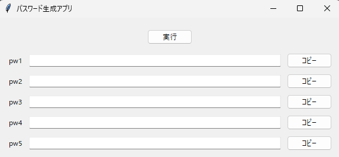

# パスワード生成GUIアプリ

Python + Tkinter で作成したパスワード生成アプリです。

## お急ぎの方へ　(Windows)
### Windows版のexeファイルのみZIP化しています。
### password-generator-guiリポジトリのreleaseのZIPファイルを解凍して使用願います。

## プロジェクトの目的

- パスワード履歴がブラウザ上に残ることを防ぐため、ローカル環境で完結するアプリケーションを自ら開発しました。

## 主な機能

- GUIで文字数、使用文字（英大文字・小文字・数字・記号）を設定
- パスワード生成・コピー・ファイル保存対応
- Windows / macOS / Linux 用の自動ビルド（GitHub Actions）

## 工夫したポイント

- ローカル実行（ブラウザに履歴を残さない）
- 5種類同時生成対応
- クリップボードコピー機能

## 実際の画面



## ローカルビルド手順

### 事前準備 ※VSCode等インストール前提
```bash
pip install pyinstaller
```

### ビルドコマンド
```bash
cd src
pyinstaller --noconsole --onefile password_app.py
```

ビルド成果物は、`src/dist/` に作成されます。

| OS      | 出力ファイル      |
|---------|--------------------|
| Windows | password_app.exe    |
| macOS   | password_app        |
| Linux   | password_app        |

必要に応じてルートディレクトリにコピーしてください。
```bash
mkdir -p ../dist
mv dist/* ../dist/
```

---

## GitHub Actions による自動ビルド・自動リリース

### ファイル構成
`.github/workflows/` 配下に次の2ファイルを配置しています。
```
.github/workflows/
├── build.yml   # 各OSごとビルド → アーティファクト保存
└── release.yml # アーティファクトをGitHub Release に添付
```

### 動作概要
| Workflow    | 動作内容                      |
|-------------|------------------------------|
| build.yml   | 各OS用バイナリをビルド         |
| release.yml | GitHub Release作成＋バイナリ添付 |

### 実行手順
- 1.バージョンタグを作成しプッシュ
```bash
git tag v1.0.0
git push origin v1.0.0
```

- 2.以下が自動実行されます
- Windows / macOS / Linux 用ビルド
- 成果物アップロード
- GitHub Release 作成

### 成果物ダウンロード
[Releases ページ](https://github.com/YOUR-REPO-NAME/releases) からOS別バイナリをダウンロード可能。

| OS      | ファイル           |
|---------|---------------------|
| Windows | password_app.exe     |
| macOS   | password_app         |
| Linux   | password_app         |

---

## 使用技術
- Python 3.x
- tkinter (標準ライブラリ)
- pyinstaller
- GitHub Actions

---

## 補足
ローカルアプリとして、ブラウザ等にパスワード履歴を一切残さず安全に利用できます。
